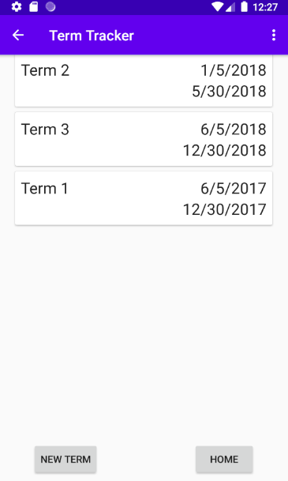
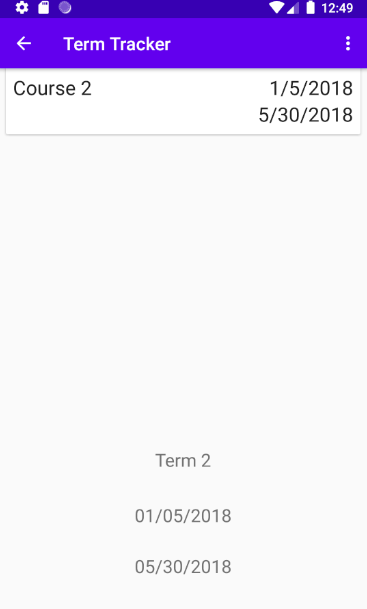
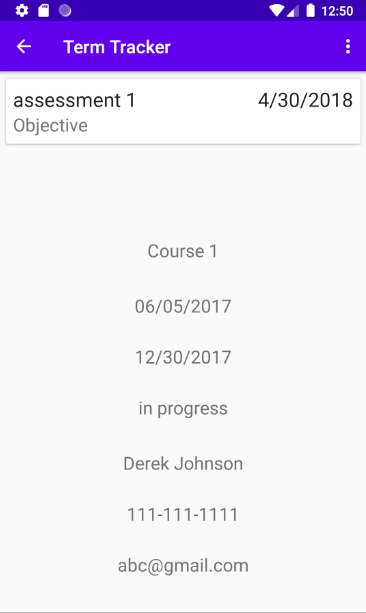

# Degree Planner Mobile App

This android app allows you to plan out your degree and also tracka assesments.

## Features

- Create a full degree plan. Including Terms, Courses and Assesments.

- Detailed Term and Course pages.

- Keep track of assessments as well as the ability to write notes.

- Ability to edit the terms and courses.

